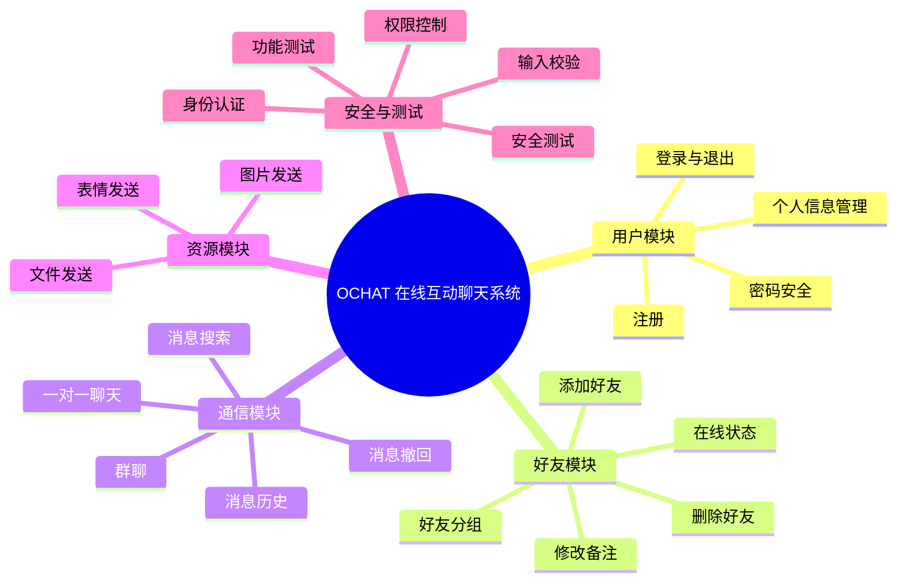

# OCHAT 在线互动聊天系统

OCHAT 是一个面向《信息系统设计与开发实践》课程的在线互动聊天系统项目，目标是完成一套具备用户管理、好友管理、实时通信、群聊、文件传输和安全防护能力的聊天软件。项目参考 QQ、微信、钉钉、飞书等即时通信产品的核心交互，采用客户端、服务器、数据库分离的方式进行设计与实现。

## 项目背景

根据课程项目要求，本项目需要围绕一个具体软件系统完成需求分析、系统设计、编码实现、测试优化和实践报告撰写。OCHAT 选择“在线互动聊天系统”作为开发主题，重点训练图形界面设计、数据库设计、Socket 网络通信、多线程并发处理、项目文档编写和系统安全设计能力。

## 功能规划

为方便后续撰写实验报告，本文档对功能来源进行了标注：

- `[课程要求]`：PPT 中明确要求实现的基础功能。
- `[个人设计候选]`：结合聊天软件使用场景提出的扩展方向，后续按实际实现情况保留。
- `[AI 辅助建议]`：由 AI 根据课程评分点和常见系统设计经验补充，实际开发时需要本人理解、筛选、修改和调试。

### 基础功能

- `[课程要求]` 用户注册：支持新用户创建账号，并进行用户名、密码等信息的合法性校验。
- `[课程要求]` 用户登录与退出：完成登录认证、登录状态维护和安全退出。
- `[课程要求]` 个人信息管理：支持头像、昵称、签名、联系方式等个人资料的查看与修改。
- `[课程要求]` 好友管理：支持添加好友、删除好友、修改好友备注、查询好友信息。
- `[课程要求]` 在线状态维护：展示好友在线、离线等状态，便于用户判断通信对象是否可用。
- `[课程要求]` 一对一聊天：实现好友之间的实时文本通信。
- `[课程要求]` 群聊通信：支持多个用户同时加入群聊并进行实时消息交流。
- `[课程要求]` 文件发送：支持常见文件格式的上传、下载和接收提示。
- `[课程要求]` 图片与表情发送：支持图片消息、常用表情选择与展示。

### 扩展功能

- `[个人设计候选]` 消息历史记录：保存私聊和群聊记录，支持重新登录后查看历史消息。
- `[个人设计候选]` 好友分组：支持按同学、老师、项目组等维度管理联系人。
- `[个人设计候选]` 群成员管理：支持创建群聊、邀请成员、移除成员和查看群成员列表。
- `[个人设计候选]` 未读消息提醒：好友或群聊有新消息时，在列表中展示未读数量。
- `[AI 辅助建议]` 消息搜索：按照联系人、群聊、关键词和时间范围检索聊天内容。
- `[AI 辅助建议]` 消息状态提示：显示消息发送中、发送成功、发送失败等状态。
- `[AI 辅助建议]` 消息撤回：允许用户在限定时间内撤回已发送消息。
- `[AI 辅助建议]` 系统通知：对好友申请、文件接收、群聊邀请等事件进行提醒。
- `[AI 辅助建议]` 安全增强：使用密码加密存储、输入过滤、权限校验和异常处理降低系统风险。

### 系统功能结构图



## 系统设计

项目计划采用三层结构：

- 客户端：负责图形界面展示、用户输入、聊天窗口、好友列表和文件选择等交互。
- 服务器：负责用户认证、在线状态管理、消息转发、群聊分发和文件传输控制。
- 数据库：负责保存用户信息、好友关系、群聊信息、消息记录和文件元数据。

推荐目录结构：

```text
OCHAT/
├── client/          # 客户端界面与交互逻辑
├── server/          # 服务端网络通信与业务处理
├── database/        # 数据库脚本、表结构和初始化数据
├── docs/            # 需求分析、设计说明、测试报告等文档
├── tests/           # 功能测试和安全测试用例
└── readme.md        # 项目说明
```

## 数据库设计方向

核心数据表可包括：

- `users`：用户账号、密码摘要、昵称、头像、签名、注册时间等。
- `friendships`：好友关系、好友备注、分组、添加时间等。
- `groups`：群聊编号、群名称、创建者、创建时间等。
- `group_members`：群成员关系、群内昵称、成员权限等。
- `messages`：消息发送者、接收对象、消息类型、消息内容、发送时间、消息状态等。
- `files`：文件名、文件大小、存储路径、上传者、上传时间等。

## 开发进度安排

- 第 1 天：安装 Python、IDE 等开发环境，完成需求分析文档和系统功能结构图。
- 第 2 天：完成系统功能设计、数据库设计、登录与注册基础流程。
- 第 3 天：完善用户注册、个人信息修改、数据校验和异常处理。
- 第 4 天：完成好友列表界面、好友添加、删除、查询和在线状态维护。
- 第 5 天：完成一对一好友实时聊天功能，调试 Socket 通信问题。
- 第 6 天：完成群聊功能，处理多用户并发通信和多线程设计。
- 第 7 天：完成文件发送、图片发送和表情选择功能。
- 第 8 天：完成身份认证、密码加密、输入防护和权限控制等安全设计。
- 第 9 天：编写测试用例，进行全系统功能测试并修复 BUG。
- 第 10 天：进行安全测试、整理实践报告、录制系统演示视频并打包提交。

## 测试计划

- 功能测试：覆盖注册、登录、好友管理、私聊、群聊、文件发送、图片发送等核心流程。
- 异常测试：验证空输入、重复账号、错误密码、网络断开、文件不存在等异常情况。
- 并发测试：验证多个客户端同时登录、群聊消息分发和在线状态同步。
- 安全测试：检查密码明文存储、SQL 注入、越权访问、非法文件上传等问题。
- 界面测试：检查页面布局统一性、按钮反馈、输入提示和操作易用性。

## 安全设计

- 密码不明文保存，使用安全哈希算法保存密码摘要。
- 登录、注册、好友操作和文件传输均进行参数校验。
- 服务端统一校验用户身份，避免客户端绕过权限限制。
- 对文件大小、文件类型和文件名进行限制，防止危险文件上传。
- 对数据库操作进行封装，优先使用参数化查询。
- 对网络异常、数据库异常和非法请求进行统一错误处理。

## AI 辅助说明

本项目允许使用 AI 工具辅助完成部分需求分析、文档整理、代码生成建议、界面优化建议、通信故障排查和测试用例设计。AI 辅助内容只作为参考，最终功能取舍、代码调试、运行验证和报告整理需要由本人完成。

### AI 辅助内容记录

| 模块 | 标注 | 说明 |
| --- | --- | --- |
| README 文档结构 | AI 辅助整理 | 根据课程 PPT 提炼项目背景、功能规划、系统设计、测试计划和提交资料。 |
| 基础功能清单 | 课程要求 | 来自 PPT 对在线互动聊天系统的基础功能要求。 |
| 消息搜索、消息撤回、消息状态提示 | AI 辅助建议 | AI 根据常见聊天系统功能补充，后续按开发进度决定是否实现。 |
| 安全设计清单 | AI 辅助建议 | AI 根据身份认证、密码加密、输入防护、权限控制等评分点整理。 |
| 好友分组、未读消息、群成员管理 | 个人设计候选 | 可作为本人后续重点完善的扩展功能，最终以实际代码和演示效果为准。 |
| 代码实现与调试 | 本人完成为主 | 具体代码需要本人理解后编写、运行、修改和测试，AI 可用于排查错误或解释思路。 |

### 报告标注示例

在实验报告中可以按如下方式说明 AI 使用情况：

```text
本项目在需求分析、README 文档结构、安全设计清单和部分测试用例设计中使用了 AI 辅助。
AI 主要用于整理课程 PPT 要求、补充常见聊天系统功能点和提供代码调试思路。
本人根据项目实际情况对功能范围进行了筛选，并完成代码编写、运行测试、界面调整和错误修复。
```


## 参考资料

- 课程 PPT：《信息系统设计与开发实践项目要求》
- 软件工程文档参考：https://github.com/cuizhenjie/software-engineering-document
