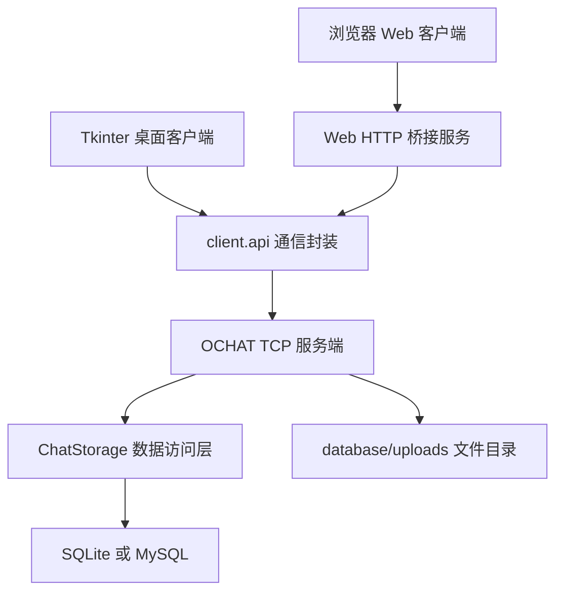

# OCHAT 在线互动聊天系统

OCHAT 是一个基于 Python 的在线互动聊天系统，包含多线程 TCP 服务端、Tkinter 桌面客户端、浏览器 Web 客户端、数据库持久化、文件传输、群聊管理和自动化测试。项目面向《信息系统设计与开发实践》课程，重点覆盖用户认证、好友关系、实时通信、历史记录、安全校验和界面交互等完整业务流程。

当前项目不是单纯的前端页面，也不是只有几个接口的演示程序。系统由服务端统一处理业务逻辑，桌面端和 Web 端都通过同一套通信协议访问后端能力。

## 项目特点

- 支持桌面端和浏览器端两种客户端。
- 使用 TCP Socket 和 JSON Lines 协议完成客户端与服务端通信。
- 服务端采用多线程处理多个客户端连接。
- 支持 SQLite 快速演示，也支持 MySQL 持久化运行。
- 登录、注册、好友、群聊、文件、消息记录等功能由服务端统一校验。
- Web 端通过本地 HTTP 桥接服务复用原有客户端通信能力，没有另起一套独立业务逻辑。
- 提供 pytest 测试用例，覆盖协议、存储、服务端、客户端入口和安全校验。

## 功能概览

### 用户与账号

- 用户注册。
- 用户登录、退出登录。
- 会话 token 恢复登录状态。
- 个人资料编辑，包括昵称、头像、签名、联系方式、生日、性别、地址和年龄。
- 密码使用 PBKDF2-SHA256 加随机盐保存，不保存明文密码。

### 好友与联系人

- 按用户名或昵称搜索用户。
- 发送好友申请。
- 接受或拒绝好友申请。
- 好友列表展示。
- 好友在线状态展示。
- 好友备注和好友分组。
- 删除好友。
- 会话列表展示最近聊天、未读数量和消息预览。

### 私聊与群聊

- 好友之间发送私聊文本消息。
- 创建群聊。
- 发送群聊邀请。
- 接受或拒绝群聊邀请。
- 群成员列表查看。
- 群主、管理员、普通成员角色管理。
- 修改群名称。
- 设置群备注。
- 设置群内昵称。
- 移除群成员。
- 退出群聊。
- 群主解散群聊。
- 群主退出后自动转让群主。

### 消息能力

- 私聊历史记录。
- 群聊历史记录。
- 新消息实时推送。
- 未读消息统计。
- 消息已读标记。
- 消息搜索。
- 消息撤回。
- 连续消息时间合并显示。
- 文本、Markdown、代码块、引用和列表的基础展示。
- 表情输入。

### 文件与图片

- 文件上传。
- 文件下载。
- 图片消息预览。
- 当前会话文件列表。
- 头像文件上传和展示。
- 文件名安全清理。
- 文件类型限制。
- 文件大小限制为 10 MB。

允许上传的后缀包括：

```text
.txt .md .pdf .doc .docx .xls .xlsx .ppt .pptx .png .jpg .jpeg .gif .zip
```

## 系统架构



### 后端职责

- 接收客户端请求。
- 分发业务 action。
- 维护在线会话和 token。
- 校验登录状态。
- 校验好友关系、群成员关系和文件访问权限。
- 保存消息、用户、好友、群聊和文件元数据。
- 推送新消息、在线状态、未读状态和申请状态。

### 桌面客户端职责

- 提供 Tkinter 图形界面。
- 完成登录、注册、联系人、聊天、文件选择、资料编辑等操作。
- 直接通过 `client.api.OchatClient` 连接 TCP 服务端。

### Web 客户端职责

- 提供浏览器聊天界面。
- 使用本地 HTTP 服务承接浏览器请求。
- 通过桥接层复用原有 TCP 客户端通信逻辑。
- 支持登录、注册、聊天、历史、文件、群聊、资料编辑和设置等功能。

## 项目结构

- `client/`：Tkinter 桌面客户端和 TCP 客户端封装。
- `server/`：TCP 服务端、协议处理、安全校验和数据库访问。
- `web_client/`：浏览器客户端、HTTP 桥接服务和前端静态资源。
- `database/`：SQLite 与 MySQL 建表脚本。
- `tests/`：协议、存储、服务端、客户端和安全测试。
- `docs/`：项目说明、数据库说明、升级记录和报告材料。
- `tools/`：本地环境检查工具。
- `scripts/`：辅助脚本。
- `start_server.py`：启动 OCHAT TCP 服务端。
- `start_client.py`：启动桌面客户端。
- `start_web_client.py`：启动浏览器 Web 客户端。

## 环境要求

- Python 3.10 或更高版本。
- Windows、macOS 或 Linux 均可运行服务端和 Web 客户端。
- 桌面客户端需要本机 Python 支持 Tkinter。
- 使用 MySQL 模式时，需要可访问的 MySQL 服务。

安装依赖：

```powershell
python -m pip install -r requirements.txt
```

检查环境：

```powershell
python tools/check_env.py
```

## 快速启动

### 方式一：SQLite 快速演示

SQLite 不需要提前安装数据库，适合课程演示和本地测试。

启动服务端：

```powershell
python start_server.py
```

启动桌面客户端：

```powershell
python start_client.py
```

启动 Web 客户端：

```powershell
python start_web_client.py
```

浏览器访问：

```text
http://127.0.0.1:8080
```

### 方式二：指定端口运行

启动 TCP 服务端：

```powershell
python start_server.py --host 127.0.0.1 --port 8765 --db-backend sqlite --db database/ochat.db
```

启动 Web 客户端：

```powershell
python start_web_client.py --host 127.0.0.1 --port 8080 --chat-host 127.0.0.1 --chat-port 8765
```

启动桌面客户端：

```powershell
python start_client.py --host 127.0.0.1 --port 8765
```

### 方式三：MySQL 模式

启动服务端时指定 MySQL 参数：

```powershell
python start_server.py --db-backend mysql --mysql-host 127.0.0.1 --mysql-port 3306 --mysql-user root --mysql-password 你的密码 --mysql-database ochat
```

服务端会读取 `database/schema_mysql.sql` 初始化表结构。上传文件默认保存在 `database/uploads/`。

## 推荐演示流程

1. 启动服务端。
2. 启动两个桌面客户端，或打开两个不同浏览器会话。
3. 分别注册两个账号，例如 `alice_1` 和 `bob_1`。
4. 两个用户分别登录。
5. Alice 搜索 Bob 并发送好友申请。
6. Bob 在申请列表中接受好友申请。
7. Alice 和 Bob 发送私聊消息。
8. Alice 创建群聊并邀请 Bob。
9. Bob 接受群聊邀请。
10. 在群聊中发送文本、图片或文件消息。
11. 测试消息搜索、文件下载、消息撤回和未读提醒。
12. 编辑个人资料，验证头像和资料同步效果。

## 测试

运行全部测试：

```powershell
python -m pytest
```

测试覆盖内容包括：

- 协议发送与解析。
- 用户注册、登录和重复用户名校验。
- 好友关系、好友申请和删除好友。
- 私聊、群聊、消息历史和未读数量。
- 群邀请、群成员、角色、群备注和群解散。
- 文件上传、文件下载和文件访问权限。
- 消息内容、搜索关键词和文件大小校验。
- 未登录访问、非好友私聊、非群成员发言等权限保护。

## 安全设计

- 密码使用 PBKDF2-SHA256 和随机盐进行哈希存储。
- 用户名限制为 3 到 20 位字母、数字或下划线。
- 密码长度限制为 6 到 64 位。
- 文本消息最大长度为 2000 字符。
- 文件或图片消息的描述文本最大长度为 240 字符。
- 搜索关键词最大长度为 80 字符。
- 数据库访问使用参数化查询。
- 服务端统一校验登录状态，客户端不能绕过权限限制。
- 私聊发送前校验双方好友关系。
- 群聊发送前校验发送者是否为群成员。
- 群管理操作校验群角色权限。
- 文件下载前校验当前用户是否有权访问该文件。
- 文件保存路径经过安全处理，避免路径穿越。

## 常见问题

### Web 页面打不开

先确认 Web 客户端服务已启动：

```powershell
python start_web_client.py
```

然后访问：

```text
http://127.0.0.1:8080
```

### 登录失败或一直连接不上

先确认 TCP 服务端已启动：

```powershell
python start_server.py
```

如果修改过端口，需要保证 Web 客户端的 `--chat-port` 与服务端端口一致。

### MySQL 连接失败

可以先使用 SQLite 模式完成演示：

```powershell
python start_server.py --db-backend sqlite --db database/ochat.db
```

MySQL 模式需要确认服务正在运行、账号密码正确，并且当前用户有创建数据库和建表权限。

### 文件无法上传

请检查文件后缀和大小。系统只允许常见文档、图片和 zip 压缩包，单个文件大小不能超过 10 MB。

## AI 辅助说明

本项目允许使用大模型辅助完成部分需求梳理、界面优化、测试用例设计、问题原因分析和文档表达整理。AI 辅助内容仅作为参考，最终功能实现、运行验证、测试结果和报告整理仍需要结合项目实际代码完成。

在报告中可以按实际情况标注：

```text
本项目在需求分析、界面优化、测试用例整理和文档表达优化中使用了大模型辅助。大模型主要用于提供思路参考和表达整理，具体代码修改、功能验证和测试结果分析由本人结合项目实际完成。
```

## 参考资料

- Python 官方文档。
- PyMySQL 官方文档。
- SQLite 官方文档。
- 课程资料《信息系统设计与开发实践项目要求》。
